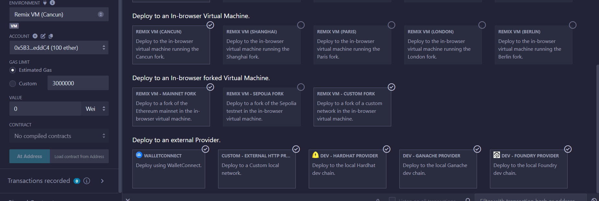

# ETH + AVAX : Smart Contract Management 

This project is a simple Pokémon NFT smart contract that can be interacted in a React-based frontend application with the use of PokéApi (https://pokeapi.co/). Transactions are made through the Metamask Wallet in a local ethereum network using Ganache. 

# Description
The Pokémon NFT is a React App that allows users to mint new Pokémon through MetaMask wallet and store it in a collection. The application calls the following functions from the smart contract the application is connected to: 

`mintPokemon(_name, _level, _type1, _type2)` mints a new Pokémon and adds it to the users' NFT Collection. The function generates a random number from 1 to 500 corresponding to the Pokémon's order in the Pokedex. 

`getPokemon(index)` returns the name of the Pokémon stored at the specified index. 

`getPokemonLevel(index)` returns the level of the Pokémon stored at the specified index. 

`getPokemonType1(index)` and `getPokemonType2(index)` returns the first and second type of the Pokémon. If the Pokémon only has one type, the second type is labeled as `None` and it is not displayed in the application. 

`getNFTSize()` returns the total number of Pokemon in the collection. 

# Getting Started

# Prerequisites 
In order to run the React application, the following software/tools is needed: 

- Node.js v20.10.0 (https://nodejs.org/en)
- MetaMask Wallet extension on Chrome, Firefox, or any preferred browser. 
- Ganache GUI (https://archive.trufflesuite.com/ganache/) - if you encountered a Sideloading is blocked by policy error, enable the Developer Mode in the Settings app in Windows10 / Windows11.

# Executing the Program
To run the React Application: 
1. Clone this Repository to specified folder 
2. Navigate into the project directory: `cd repo-name` 
3. Inside the directory, install the dependencies: `npm install`

Once the dependencies are installed, 
1. Open the Ganache App.
2. On the main menu, click 'Quickstart Ethereum'

3. On the new screen, copy the RPC Server URL

4. Minimize the Ganache App

To set up the Metamask Wallet, 

1. Click the extension on your browser and log in
2. Once logged in, click on the upper-left icon. 

3. In the Select Network, click 'Add Network'

4. In the newly opened tab, click 'Add network manually' and fill in the details needed:
    - Network Name : "Ganache"
    - RPC URL: Paste the RPC URL you copied from the Ganache App 
    - Chain ID : 1337
    - Currecny Symbol : ETH
    - Leave the Block explorer URL blank

5. After saving, select the new network. 
6. On the main interface of the wallet, click the Account dropdown 
7. Click the "Add account or hardware wallet" button, and then click the "Import Account"
8. Return from the Ganache App and from one of the accounts, click the key icon on the farthest right and copy the Private Key. 

9. Paste the Private Key in the Private Key field in the MetaMask Wallet. 

Once the account is imported, 
1. Go to https://remix.ethereum.org/ 
2. In the File Explorer, click the Create new file icon 
and name the file as PokemonNFT.sol 
3. From the cloned repository, copy the code of PokemonNFT.sol inside the contracts folder and paste it into the new file in the REMIX IDE. 
4. Click the Solidity compiler in the left side bar,  
set the compiler option to 0.8.0, then click "Compile PokemonNFT.sol". 
5. After the contract is compiled, click "Deploy & run transactions" and set the environment to "Dev - Ganache Provider" through the "Customize this List", and once the accounts (same as in Ganache App) are loaded, click Deploy.

6. Scroll down, to the Deployed/Unpinned Contracts and copy the contract address by clicking on the the Copy Address icon.

7. In the App.js in src folder, paste the contract address 
into the `contractAddress` variable at line 10. 
8. To run the app, enter `npm start` command. The application will automatically open up in the browser 
at `http://localhost:3000`. 

Once the application loads, open the MetaMask wallet and connect the imported account to the localhost displayed at the bottom. You can now mint and view Pokemon NFTs.
 
 # Authors 
 Seth Gruspe

@black-walrus

 # Credits 
 - This project uses data from [PokéAPI](https://pokeapi.co/) by Paul Hallett and PokéAPI contributors (https://github.com/PokeAPI/pokeapi#contributing)